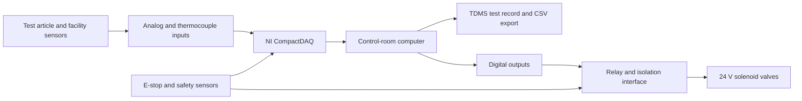

# SPIRIT Electrical and Data Acquisition

This repository supports the electrical, instrumentation, control, and data-acquisition work for the **Subscale Propulsion Integration, Research, and Instruction Testbed (SPIRIT)** at the University of Illinois Urbana-Champaign.

SPIRIT is a modular rocket-propulsion test facility intended to support research, instruction, and student projects involving solid, hybrid, and liquid engines. The current design effort focuses on a **10 kN testbed** that will serve as a proof of concept for larger test infrastructure.

## Electrical team scope

The electrical team is responsible for the systems that connect the test article, fluid system, safety hardware, and control room:

- Sensor selection, excitation, signal conditioning, and calibration
- Data-acquisition hardware and channel allocation
- Solenoid-valve actuation through isolated power and relay interfaces
- Test sequencing, live monitoring, and data recording
- Emergency-stop and facility-safety signal integration

## System architecture

The preliminary design uses a modular **National Instruments CompactDAQ** platform. The selected concept provides analog inputs for pressure, thrust, and safety instrumentation; cold-junction-compensated thermocouple inputs; and digital outputs for valve control. A spare chassis position allows future expansion.

## Preliminary I/O baseline

| Function | Current baseline |
| --- | --- |
| Analog input capacity | 32 channels |
| Estimated analog inputs in the PDR | 21 channels |
| Thermocouple capacity | 16 channels with cold-junction compensation |
| Estimated digital outputs in the PDR | 14 channels |
| Digital output capacity | 32 channels |
| Fluid-system instrumentation | 12 pressure transducers and 6 thermocouples |
| Test-article instrumentation | Load cell, 8 thermocouples, accelerometer, and pressure transducers |
| Data products | Raw TDMS files with CSV export for post-processing |

The DAQ must capture synchronized thrust, pressure, temperature, mass-flow, valve-state, and safety data at rates appropriate for each measurement. The control software will store reusable channel configurations, sensor scaling, calibration data, and test definitions.

## Instrumentation and control

### Pressure measurement

The fluid-system pressure-transducer baseline calls for:

- 3,000 psi rating
- Voltage output with a 1 ms response time
- 316 stainless-steel wetted construction
- Oxygen-clean compatibility for oxidizer service
- Operating temperature from -40 °C to 85 °C
- Isolated 9–36 V excitation

Thermal standoffs will protect transducers near cryogenic plumbing. The current estimate uses an approximately 3 in standoff, subject to final thermal and installation analysis.

### Temperature measurement

Type T thermocouples provide the required cryogenic range. The current candidate is rated from -200 °C to 260 °C and connects to a dedicated cold-junction-compensated module.

### Thrust measurement

The thrust channel uses a compression load cell and bridge measurement. The final sensor must support the 5 kN engine class, provide suitable overload margin, and meet the required accuracy at both nominal and lower thrust levels. Excitation, bridge completion, and off-axis-load performance still require validation before the design is frozen.

### Valve actuation

The DAQ commands fluid-system solenoids through a relay interface. The valves use an independent, isolated 24 V supply because the DAQ cannot provide the required actuator current. The preliminary firing case assumes up to four general-purpose valves and four smaller valves operating simultaneously, for an estimated peak draw of 4.8 A.

### Field connections

A BNC bulkhead panel provides a maintainable boundary between field wiring and the DAQ. The metal panel and coaxial connections improve electromagnetic shielding, establish a controlled ground reference, reduce exposed wiring, and make sensor replacement and troubleshooting easier.

## Safety integration

The electrical system will monitor facility hazards and support an automatic safe state. Planned inputs include:

- Oxygen concentration
- Lower explosive limit for flammable gases
- Carbon monoxide
- UV/IR flame detection
- Pressure and temperature limit signals
- Emergency-stop status

Safety logic must terminate ignition and propellant flow when an emergency stop is activated or when approved trip conditions occur. The detailed interlock architecture, reset behavior, fault handling, and independent layers of protection require formal review before implementation.

## Open design decisions

The source presentations identify several items that remain unresolved:

- Select and document the control-software baseline. The current material references both Python and LabVIEW.
- Confirm whether the test article requires two or four pressure transducers.
- Complete the load-cell trade study and validate excitation, bridge, overload, and off-axis-load requirements.
- Finalize the BNC bulkhead channel count, panel dimensions, grounding plan, and enclosure layout.
- Obtain final quotations for test-article pressure transducers and the accelerometer.
- Complete the facility electrical load analysis and coordinate normal, backup, and emergency power.
- Define and review the complete cause-and-effect matrix for alarms, interlocks, and emergency shutdown.

## Design status

This overview reflects the **5 kN testbed PDR dated July 2, 2026** and the **Electrical Component Selection review dated August 7, 2026**. Values and selections should be treated as preliminary until they appear in an approved requirement, drawing, bill of materials, or test procedure.

## Repository goals

As the design matures, this repository will provide a controlled home for:

- Electrical architecture and interface documentation
- I/O maps and wiring definitions
- Sensor specifications and calibration records
- DAQ and control software
- Reusable test configurations
- Verification plans and test results
- Reviewed operating and safety documentation

